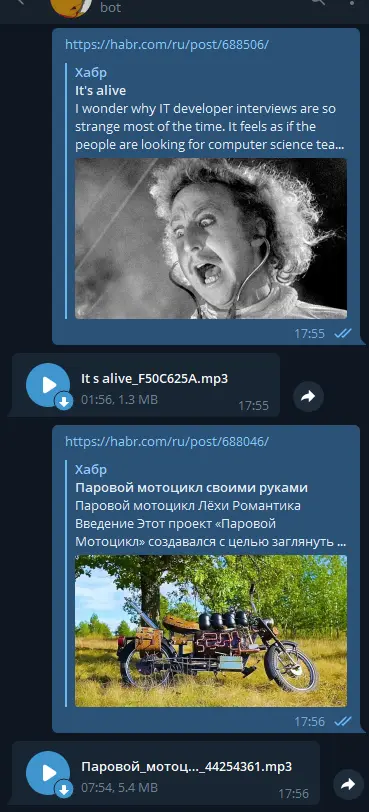

<h1>Narrator</h1>
<div align="center">



</div>

A personal use [telegram](https://telegram.org/) bot to generate MP3 files based on text from the webpage.

- [About](#about)
  - [How it works](#how-it-works)
  - [Why I made it](#why-i-made-it)
- [Building](#building)
  - [Software requirements](#software-requirements)
  - [First run](#first-run)
- [Licensing](#licensing)

## About
### How it works
You drop a url — you get an mp3, voiced by either "Microsoft Irina Desktop" (if it's in Russian) or "Microsoft Zira Desktop" (if it's in English).

Additional feature: You also can drop a file of a supported format.

It uses a plenty of third party software:
- [**blb2txt**](http://www.cross-plus-a.com/btext.htm) — to extract text from the various types of files
- [**balcon**](http://www.cross-plus-a.com/bconsole.htm) — to voice the text with [Microsoft Speech API (SAPI)](https://en.wikipedia.org/wiki/Microsoft_Speech_API)
- [**ffmpeg**](https://github.com/FFmpeg/FFmpeg) — to perform `.wav` → `.mp3` conversion
### Why I made it

I really like Microsoft voice engines among all the others, and I'd like to have a tool to voice small news articles using only smartphone (at least on the client side).

This bot was designed for personal usage. It is assumed to never have more than 3-5 active users. 


## Building
### Software requirements
- OS Windows 10 (the bot uses SAPI5 only available on Windows)
- [**python3.10**](https://www.python.org/downloads/)

- [**make**](https://en.wikipedia.org/wiki/Make_(software)) tool — for build-automation. To install it on Windows, one can try [GNU make 4.3](https://community.chocolatey.org/packages/make)  package from the [Chocolatey](https://github.com/chocolatey/choco) package manager.

- [**Poetry**](https://python-poetry.org/) — to administer Python dependencies.
- [**blb2txt**](http://www.cross-plus-a.com/btext.htm) — (optional) to convert from various doctypes to `.txt`
- [**balcon**](http://www.cross-plus-a.com/bconsole.htm) — to perform `.txt` → `.wav` conversion
- [**ffmpeg**](https://github.com/FFmpeg/FFmpeg) — to perform `.wav` → `.mp3` conversion

### First run
1. In the project directory execute:

    ```bash
    poetry install
    ```
    \- to download all the Python packages required. 
2. Rename the `example.env` file into `.env`. Replace the dummy values in it with real ones.

    Alternatively you can declare the values from `.env` as environment variables.

3. In `config.yml` in `utils` section replace the mock paths with the real ones.

4. Either in `.env` or in `config.yml` you should specify the telegram usernames allowed to communicate with the bot.
5. Run `make run` to launch the bot.


## Licensing
- Current repository is licensed under [MIT License](https://github.com/sentenzo/narrator/blob/master/LICENSE)
- the external utilities:
  - [ffmpeg](https://github.com/FFmpeg/FFmpeg) is licensed under a [mixed license](https://github.com/FFmpeg/FFmpeg/blob/master/LICENSE.md), compatible with MIT License
  - [balcon](http://www.cross-plus-a.com/bconsole.htm) and [blb2txt](http://www.cross-plus-a.com/btext.htm) are distributed under a custom freeware license, compatible with MIT License (with some caveots)
